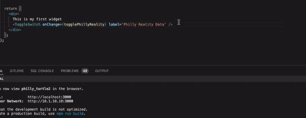
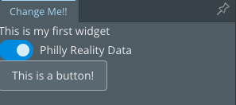

# Add Interactions

We added a widget, `MyFirstWidget.tsx`, to add the reality data toggle.  Now that we have a widget you can use that widget as a place to add new functionality.

## Before Getting started

Make sure you have the project opened in the container.  If not use the command.

`>Dev Containers: Reopen in container`


Once open in container start the application by running `npm start`

## Understanding jsx

We want to add a button to the widget so go to the file `src/providers/MyFirstWidget.tsx`

At the bottom find the portion of the code that returns the contents of the widget:

```typescript
  return (
    <div>
      This is my first widget
      <ToggleSwitch onChange={togglePhillyReality} label='Philly Reality Data' />
    </div>
  );
```

The contents of the widget is a special form of `html` called `jsx`.  It is html elements and react components mixed together and is converted into pure html when shown in the browser.  Here is the html:

```html
<div>
  This is my first widget
  <label class="iui-toggle-switch-wrapper iui-label-on-right">
    <input class="iui-toggle-switch" type="checkbox" role="switch">
    <span class="iui-toggle-switch-label">Philly Reality Data</span>
  </label>
</div>
```

> Notice that there is an outer `div` element and text remains the same but the `ToggleSwitch` is converted from jsx into html.  For the most part we can ignore the generated html, but knowing is half the battle.

## Add the button

The button we want to add is another React component called `Button`, add it below the `ToggleSwitch` like this:



This should have automatically updated an import statement towards the top of the page to pull the button in from the same library as the ToggleSwitch:

```typescript
import { Button, ToggleSwitch } from "@itwin/itwinui-react";
```

If not update the import statement.

Save the file, wait for it to recompile then go check out the web page, you should see a button:



## Adding a button click function

You can click on the button but it doesn't do anything because we have not told it what to do.  To do that we need to create a function.

> A function is a block of code that runs when we call it, for example the `togglePhillyReality` function in `MyFirstWidget.tsx` turns the reality data on and off when the toggle switch is clicked.

We need to create our own function that is run when the button is clicked.  

```typescript
  const buttonClicked = async () => {
    alert("You clicked the button!");
  }

  return (
    <div>
      This is my first widget
      <ToggleSwitch onChange={togglePhillyReality} label='Philly Reality Data' />
      <Button onClick={buttonClicked}>This is a button!</Button>
    </div>
  );
```

The first three lines are the function, it is connected to the button using this snippet of code `onClick={buttonClicked}`.  The function assigned to `onClick` is run every time the button is clicked.

## What is state

The current state of an application is called its 'State'.  In our app this includes what model you are viewing, if the widget is open and if reality data is turned on or off.

To be able to modify state you need to learn about state variables, a variable stores information in a program.  Here is an example of a variable that declares `someText` as an array of strings with the values `banana` and `apple` stored in it:

```typescript
const someText: string[] = ["banana", "apple"];
```

To find an example of a state variable look towards the top of the file find the following code:

```typescript
const [initialized, setInitialized] = React.useState<boolean>(false);
```

In this case we are declaring two variables `initialized` as part of react state and `setInitialized` as a function that updates the state of `initialized`.  The code after the equal sign `React.useState<boolean>(false)`, sets the initial value of these two variables and determines their types.  `initialized` is a boolean variable so it stores `true` or `false`.

## Add State

Below the existing state variables add a new variable called `listOfThings` and a function that sets it called `setListOfThings`.  It should be an array of strings and start empty.

```typescript
const [listOfThings, setListOfThings] = React.useState<string[]>([]);
```

> Take a moment to read this code and compare it to the other variables near it.

## Update State

The `setListOfThings` method updates the state but we never call it so `listOfThings` stays empty.  So lets add a string to the list every time the button is clicked.  To do this update the `buttonClicked` function to call the `setListOfThings` function:

```typescript
  const buttonClicked = async () => {
    alert("You clicked the button!");
    setListOfThings([...listOfThings, "Banana!!"])
  }
```

This will add `Banana!!` to the list every time the function is called.  The code `...listOfThings` takes everything already in the list and adds it to the new list created by the square brackets.  Take a look back at the example creating a list of text:

```typescript
const someText: string[] = ["banana", "apple"]; // Creates a list with banana and apple in it
const moreText: string[] = [...someText, "pear"]; // Creates a list with banana, apple and pear
```

## Show the state in the UI

To show the list of strings we are updating in the UI we can use an [html list](https://www.w3schools.com/HTML/html_lists_unordered.asp).

```typescript
  const thingList = listOfThings.map((thing: string) => <li>{thing}</li>);

  return (
    <div>
      This is my first widget
      <ToggleSwitch onChange={togglePhillyReality} label='Philly Reality Data' />
      <Button onClick={buttonClicked}>This is a button!</Button>
      <ul>
        {thingList}
      </ul>
    </div>
  );
```

The first line creates the entries of the html list using the `map` function, map returns a new array by calling the a function on each entry of the existing array.  In this case the function `(thing: string) => <li>{thing}</li>` creates an html list entry for each thing in the `listOfThings`.

The three `<ul>` element defines the list, if you look at the generated html it will look like this after you have clicked the button three times:

```html
<ul>
  <li>Banana!!</li>
  <li>Banana!!</li>
  <li>Banana!!</li>
</ul>
```

Save the code and try it out.

## Try on your own

Try some of the following things on your own:

- Remove the alert message
- Add a second button that adds a different string to the list
- Add a button that removes the top entry in the list.  (hint: search for the array slice method)
- Rename functions and variables to match their function

