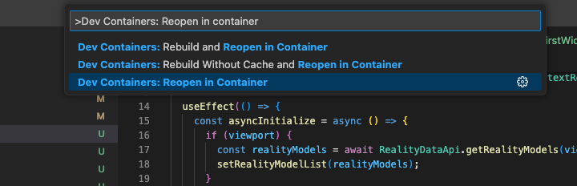

# Save Selection

When you click on a building it is selected, the selected building(s) can be saved by saving the Ids of each element that represents each building.  Once you can save a selection you can add other buildings to the selection and re-select the elements again.

To do this we need add a state variable to store the selection and buttons to manipulate the state.

## Step 1 - Open your application and setup to run/buid

Open your repository in VS Code and then restart the app in the container.  You should see a dialog box to open in a container in the lower right hand corner of the VS Code window.  

If not use the command: `>Dev Containers: Reopen in container`



This will ensure you can build and hot reload without issues.

## Step 2 - Add state

Find the file `MyFirstWidget.tsx` file, we will do everything in this file today.

Find the existing state variables towards the top of the file.  The new state should have the type `Id64Array`, be called `selectedBuildings` and have a function `setSelectedBuildings`, initialize it to an empty array `[]`

## Step 3 - Add button to save current selection to the state

Add a button under the `ColorPickerButton` with the text 'Save Selected Building' and an `onClick` function called `saveBuilding`.

> HINT - The existing buttons are towards the bottom of the file.

The `saveBuilding` method will take the current selection and save it to the sate.  Here is the code that does that, put it inside the `saveBuilding` method you created.

```typescript
    if (viewport?.iModel.selectionSet.isActive) { // If something is selected
      const newSelectedBuildings = [...selectedBuildings, ...viewport.iModel.selectionSet.elements]; // Merge the current saved selection with what is currently selected
      setSelectedBuildings(newSelectedBuildings);  // Save the new selection to the sate
    }
```

## Step 4 - Add button to select the saved buildings

Add a new button under the Save Building button you just added.  This one should have the text 'Select Saved Buildings' and a `onClick` method called `selectSavedBuildings`.

The `selectSavedBuildings` method will clear the current selection then take the saved state and set it to the current selection state.  Here is the code that does that, put it inside the `selectSavedBuildings` method you created.  

```typescript
    if (viewport) {
      viewport.iModel.selectionSet.emptyAll();
      viewport.iModel.selectionSet.add(selectedBuildings);
    }
```

## Step 5 - Test your app

Make sure your changes are saved, then run the command `npm run start` to start the application.

> Remember - You need to have your editor opened in the Dev Container as specified in Step 1.

To test the changes:

- Turn on the 3d view of the city.  
- Select a building
- Click the `Save Selected Building`
- Select another building and click the button again

You should see both buildings selected.

## Things to try

- Make a button to clear the saved buildings
- Make a button to zoom to fit the selected buildings in the view.  You can zoom to fit a set of elements into a view using code like this `viewport?.zoomToElements(aListOfElements)`
- Make a button to remove a single Building from the saved selection